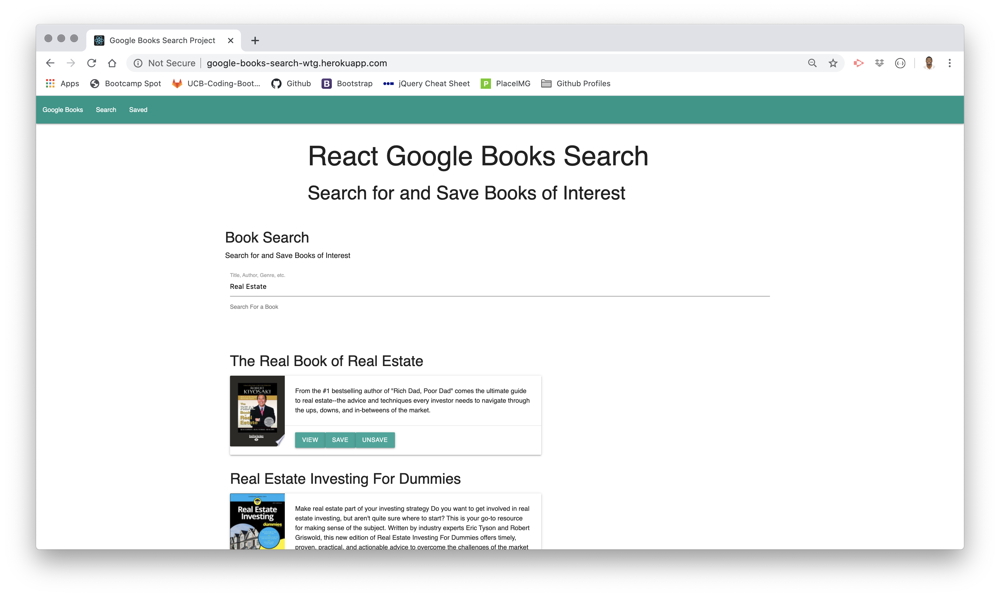
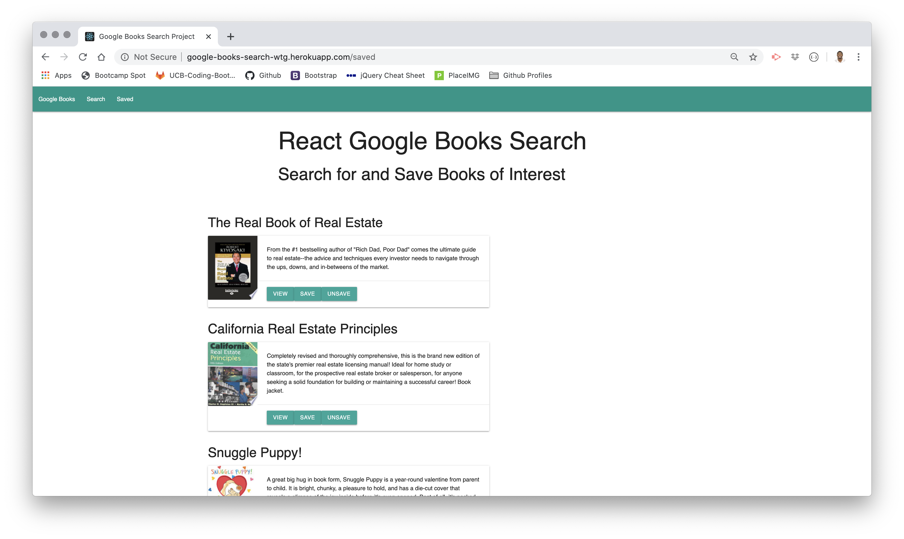

# 21 MERN: Google Books Search Project

## Summary 

The purpose of the assignment was to create a new React-based Google Books Search app. This assignment required React components, helper/util functions, and React lifecycle methods to query and display books based on user searches. It also uses Node, Express and MongoDB so that users can save books to review or purchase later.

```
Minimum Criteria

This application requires 2 pages:
    
* Search - User can search for books via the Google Books API and render them here. User has the option to "View" a book, bringing them to the book on Google Books, or "Save" a book, saving it to the Mongo database.

* Saved - Renders all books saved to the Mongo database. User has an option to "View" the book, bringing them to the book on Google Books, or "Delete" a book, removing it from the Mongo database.

```

## Application Site





## Technologies Used

- HTML - used to create elements on the DOM
- CSS - styles HTML elements on page
- Materialize - a design language that combines the classic principles of successful design along with innovation and technology
- Node.js - asynchronous event-driven JavaScript runtime
- Express - Node.js web application server framework, designed for building web applications
- MongoDB - document-based, NoSQL database built for modern application developers and the cloud era
- React.js - JavaScript library for building user interfaces
- JSX - a syntax extension to JavaScript used with React to describe what the UI should look like by producing React “elements”
- Git - version control system to track changes to source code
- GitHub - hosts repository that can be deployed to GitHub Pages
- Heroku - cloud platform that lets developers build, deliver, monitor and deploy apps rapidly

## Installation & Use

To use the application simply use the deloyed site link below and Search for a new book and add it to your Saved library:

https://google-books-search-wtg.herokuapp.com/

## Code Snippet

Below is the render function of our stateful SearchContainer component, which leverages several other subcomponents as well as passes props for the children elements to use from the parent.

```js
render() {
    return (
        <div>
            <div className="row">
                <Jumbotron/>
            </div>
            <div className="row">
                <div className="row">
                    <h4>Book Search</h4>
                    <h6>Search for and Save Books of Interest</h6>
                </div>
                <SearchForm search={this.state.search} handleFormSubmit={this.handleFormSubmit} handleInputChange={this.handleInputChange}/>
            </div>
            <div className="row"> 
                {this.state.books.map( book => {
                    let image = ""

                    if(book.volumeInfo.imageLinks) {
                        image = book.volumeInfo.imageLinks.thumbnail 
                    }
                    else {image = "https://via.placeholder.com/128x150?text=No+image"}

                    return <BookListCard key={book.id} title={book.volumeInfo.title} description={book.volumeInfo.description} image={image} link={book.volumeInfo.infoLink} book = {book} handleClick={this.saveBook}/>
                }
                )}
            </div>
        </div>
    )
}
```
<!-- [Deployed Site](https://google-books-search-wtg.herokuapp.com/) -->

[GitHub Project Repo](https://github.com/wtgibson/google-books-search-project)

## Author Links


Will Gibson

[LinkedIn](https://www.linkedin.com/in/wtgibson/)

[GitHub](https://github.com/wtgibson)


Dan Fellows

[LinkedIn](https://www.linkedin.com/in/dan-fellows-ba88a041/)

[GitHub](https://github.com/dfel08)


Kasey Chang

[LinkedIn](https://www.linkedin.com/in/kasey-chang/)

[GitHub](https://github.com/kschang77)